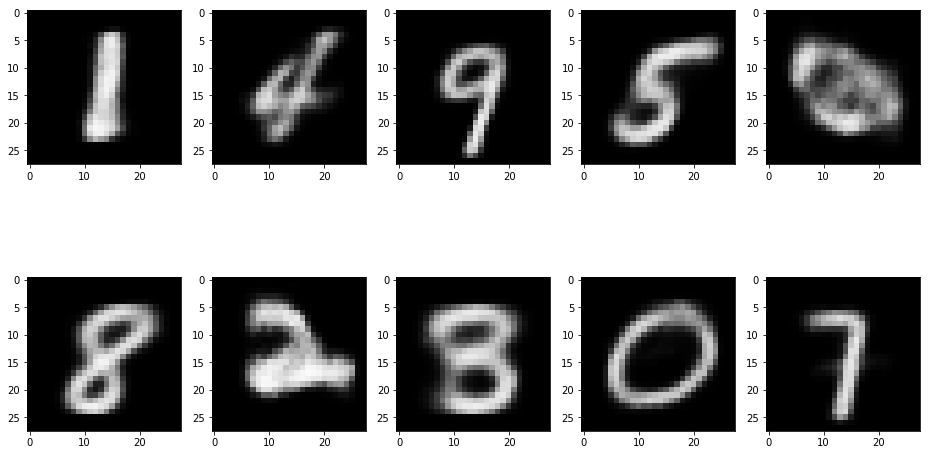

# VAE-MNIST

Jupyter notebook with Tensorflow implementation of variational autoencoder trained on MNIST. Flexible in the use of arbitrary feedforward layers. 

Reference: https://arxiv.org/abs/1606.05908
